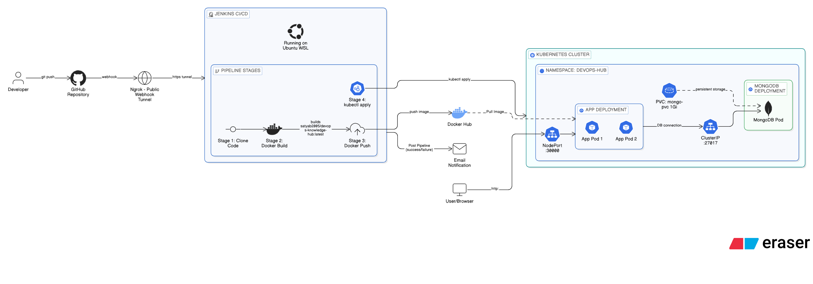
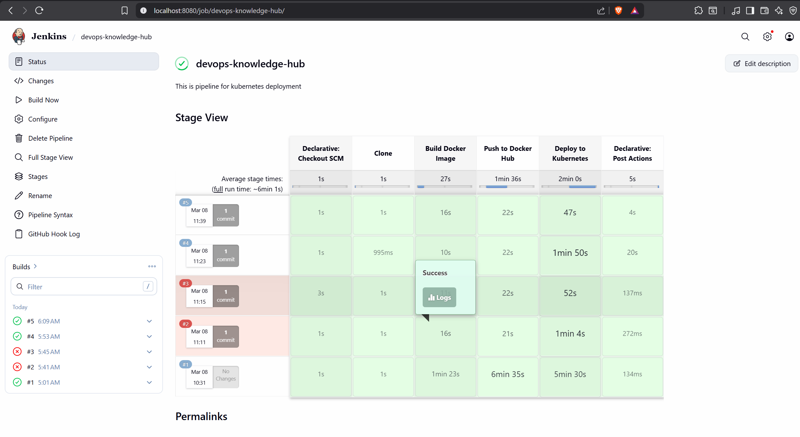
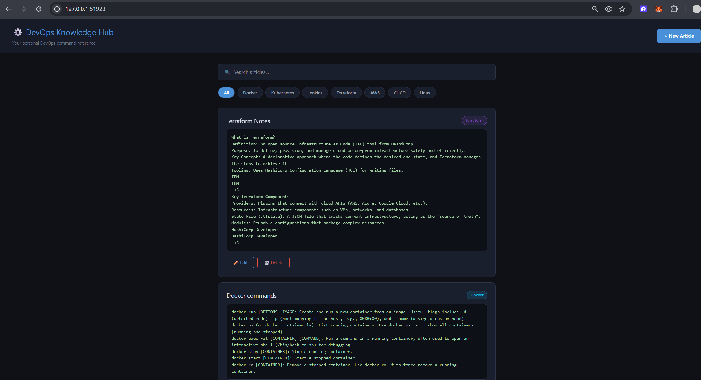
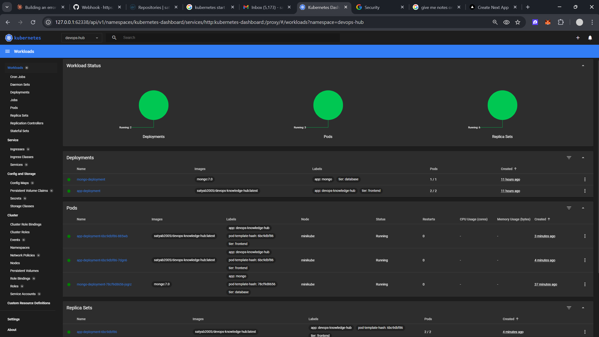
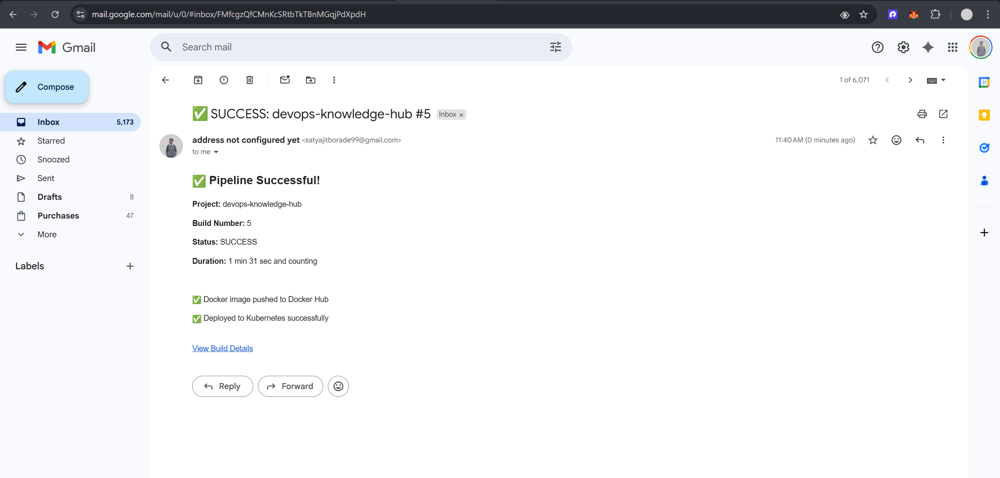

# ⚙️ DevOps Knowledge Hub

> Full-stack DevOps article manager — containerized, orchestrated and auto-deployed using industry-standard tools.

[](https://hub.docker.com/r/satyab2005/devops-knowledge-hub)
[](https://kubernetes.io/)
[](https://www.jenkins.io/)
[](https://nextjs.org/)
[](https://www.mongodb.com/)

---

## 📺 Demo

[](https://www.youtube.com/watch?v=YOUR_VIDEO_ID)

---

## 🏗️ Architecture




---

## 🚀 Quick Start

```bash
# Clone
git clone https://github.com/satyab2005/devops-knowledge-hub.git
cd devops-knowledge-hub

# Run with Docker Compose
docker compose up -d
```
Open: **http://localhost:3000**

---

## ☸️ Kubernetes Deploy

```bash
minikube start --driver=docker

kubectl apply -f k8s/namespace.yaml
kubectl apply -f k8s/configmap.yaml
kubectl apply -f k8s/secret.yaml
kubectl apply -f k8s/mongo-pvc.yaml
kubectl apply -f k8s/mongo-deployment.yaml
kubectl apply -f k8s/mongo-service.yaml
kubectl apply -f k8s/app-deployment.yaml
kubectl apply -f k8s/app-service.yaml

minikube service app-service -n devops-hub
```

---

## 🔁 CI/CD Pipeline

Every `git push` automatically:

```
Clone → Docker Build → Push to Hub → Deploy to K8s → Email Notification
```



---

## 📸 Screenshots

| App | Kubernetes | Email |
|---|---|---|
|  |  |  |

---

## 🛠️ Tech Stack

| Tool | Purpose |
|---|---|
| Next.js + MongoDB | Full stack application |
| Docker + Docker Hub | Containerize and store image |
| Kubernetes (Minikube) | Run with 2 replicas + PVC |
| Jenkins + GitHub | CI/CD automation |
| Ngrok | GitHub webhook tunnel |
| Gmail SMTP | Pipeline notifications |

---

## 📁 Structure

```
devops-knowledge-hub/
├── src/                    # Next.js app
├── k8s/                    # Kubernetes manifests
├── Dockerfile
├── docker-compose.yml
└── Jenkinsfile
```

---

## 👨‍💻 Author

**Satyajit**
[](https://github.com/BitsnBytes99)
[](https://www.linkedin.com/in/satyajit-borade-a7294b278/)
[](https://hub.docker.com/u/satyab2005)

> ⭐ Star this repo if it helped you!
